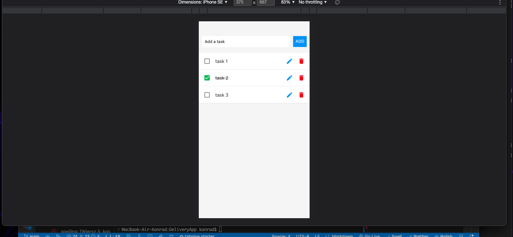
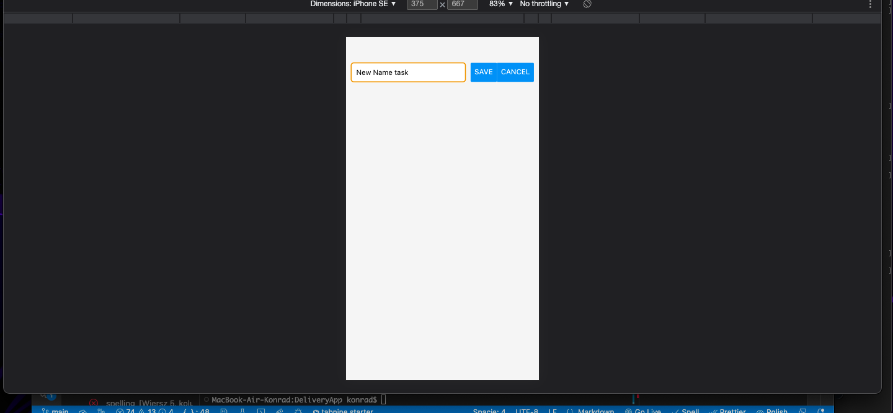

<h1>Todo App using React-Native and Context API</h1>
This is a Todo App created using React and Context API. It is a simple and straightforward app that helps you manage your daily tasks.

  
  

<h2>Installation and Usage</h2>
To use this app on your local machine, you should have Node.js and npm installed. Clone the repository and then run the following commands in the project directory:

Copy code
```
npm install
npm start
```

<h2>Functionality</h2>
The app is designed to allow the user to add, delete, and edit tasks.  The tasks are stored in local storage so that they persist even after the app is closed.

The app is built using Context API, custom hooks, and HOC (Higher Order Components) to manage state and functionality.

<h2>Features</h2>
Add tasks
Delete tasks
Edit tasks
Persist data in local storage

<h2>Technologies Used</h2>
React
Context API
Custom Hooks
Higher Order Components

<h3>License</h3>
This project is licensed under the MIT License.

<h3>Contributing</h3>
Feel free to contribute to this project. Just fork it and create a pull request with your changes.

<h3>Acknowledgments</h3>
This project was created as part of the learning process and was inspired by other Todo apps available online.